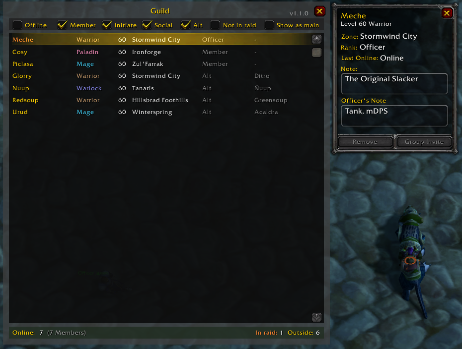
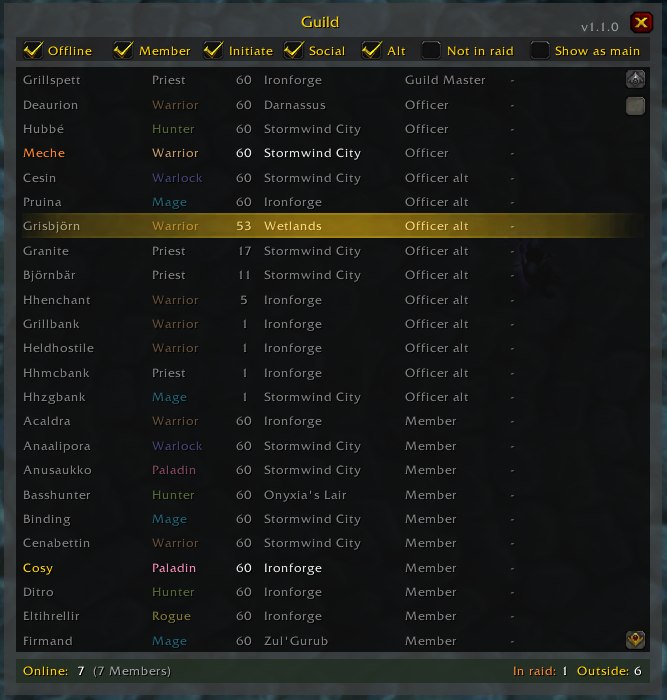
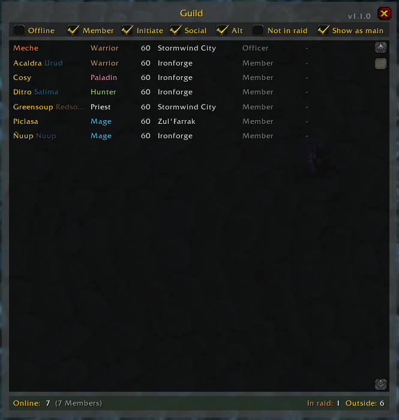

## Held Hostile Guild frame

A World of Warcraft Classic addon that adds an improved guild frame for managing players in the guild.

Specifically talored for the guild setup used by the Classic guild Held Hostile.

### Features
- Larger guild window for easy overview
- More columns of information
- Regular scroll frame
- Filters for member ranks
- Basic Alt-character understanding
  - Example: Social filter filters out alts with a main with the Social rank
- Keybinding option
- LibDataBroker integration (such as for Titanbar)

### Main window
Guild member controls using blizzards default widget.

### Show offline

### Show alts as main
Showing the main characters for players that are online, even if they are currently playing an alt.

---

### TODO
- Checkboxes in list for prepared invites with button
- LDB integration
  - Hover guild overview (online)
- Filter for time-since-online?
  - Remove old
  - Show only old?
- Sorting
  - Rank > Class > Level > Name as default?
  - Special for show-as-main as we sort by the mains instead?
- Default guild tools
  - Change rank (Cant, its protected..?)
  - Modify note/officer note
  - Show officer note?

#### UI
- Filter
  - Level 55+
- Dark class color to main name for alt characters?